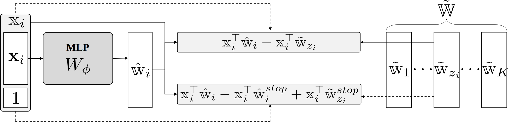

# Covariate-Guided Clusterwise Linear Regression for Generalization to Unseen Data

This repository provides the implementation of the paper **"[Covariate-Guided Clusterwise Linear Regression for Generalization to Unseen Data](https://iclr.cc/virtual/2026/poster/10011820)"**.
<p align="center">

</p>


<p align="center">
  
</p>

---

### Table of Contents

1. [Installation](#installation)
2. [Usage](#usage)

   * [run.sh](#runsh)
   * [Parameter Settings](#parameter-settings)
3. [Scripts & Notebooks](#scripts--notebooks)
4. [Dependencies](#dependencies)
5. [Datasets](#datasets)

---

## Installation

Clone this repository and install required packages:

```bash
cd Covariate-Guided Clusterwise Linear Regression
python -m pip install -r requirements.txt
```

---

## Usage

### run.sh

The `run.sh` script runs `main.py` and redirects output to a log file:

```bash
#!/bin/bash
python main.py "$@" > ./logs/output.log
```

Make sure `logs/` directory exists before running.

### Log Output

After each run the `./logs/output.log` will contain both training progress and your final test‐set metrics. A typical snippet looks like:

```log
Start Training
Training End... Epoch 1562 (Early Stopping at 561 with VAL RMSE 5.128)
Time(s): 12
[Experiments 1<1>] [Final MSE] 32.344353 [Final RMSE] 5.6872095725555925
Start Training
Training End... Epoch 5557 (Early Stopping at 4556 with VAL RMSE 4.716)
Time(s):  43
[Experiments 1<2>] [Final MSE]  25.898144 [Final RMSE]  5.089021887191147
...
[concrete]: 5.540374036662042 +- 0.39212061179548924
```
- **Final MSE** and **Final RMSE** report your model’s performance on the test set.

#### Parameter Settings

You can customize training via command-line arguments in `run.sh`. The available options are:

```bash
--max_epochs  
--patience
--proxy_hidden_shape
--dropout
--coverage
--num_K
--lr
--batch_size
--dataset_name_list
```

Example:

```bash
./run.sh --max_epochs 10000 --patience 1000 --proxy_hidden_shape 64 64 64 --dropout 0.2 --coverage large --lr 1e-3 --batch_size 256 --dataset_name_list concrete
```
or
```bash
./run.sh --max_epochs 6000 --patience 300 --proxy_hidden_shape 32 64 32 --dropout 0.1 --num_K 2 --lr 1e-2 --batch_size 128 --dataset_name_list housing wine
```
> **Note:** `--coverage` and `--num_K` are mutually exclusive: if `--num_K` is specified, `--coverage` is ignored.

---

## Scripts & Notebooks

* **`model_module.py`**: Defines the CG-CLR architecture.
* **`train_module.py`**: Implements training and evaluation routines.
* **`simulation_example.ipynb`**: Contains code for synthetic data experiments and generates figures from the paper. Outputs are saved under `./img/`.

---

## Dependencies

Tested on **Windows 11**, **Python 3.9**.

```
matplotlib==3.9.2
numpy==1.26.4
pandas==2.2.3
scikit-learn==1.5.2
scipy==1.11.4
ucimlrepo==0.0.7
ipykernel==6.29.5
torch==2.5.1+cu118
torchaudio==2.5.1+cu118
torchvision==0.20.1+cu118
```

---

## Datasets

* **UCI benchmarks** (excluding California Housing):
  Download via `ucimlrepo.fetch_ucirepo(...)`.
* **California Housing**: Fetch with `sklearn.datasets.fetch_california_housing(...)`.
* **Preprocessed datasets** used in the paper: available through `load_data` in `data_module.py`.

---
